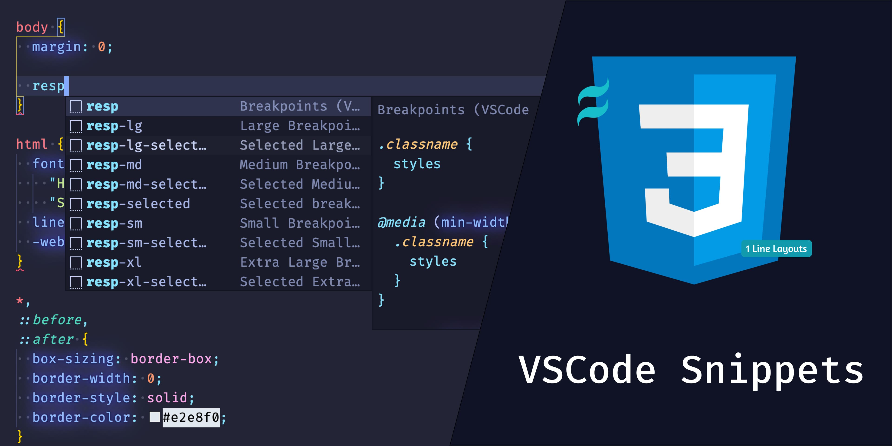

# VSCode CSS Snippets

## Description

Collection of CSS Snippets to make your life easier by auto-completing your
desired styles based on popular CSS Library -
[Tailwind](https://tailwindcss.com/) and
[1 line layouts](https://1linelayouts.glitch.me/)

It's not debatable, most of us got used to utility classes from
[Tailwind](https://tailwindcss.com/), [BootStrap](https://getbootstrap.com/)
etc,. But when you come back to write plain CSS, wouldn't be great to have those
utility classes converted as snippets instead of typing the CSS rules?

Apart from CSS Utility snippets, collection of snippets from popular CSS
examples found all over the web can be found.

To see the list of all the CSS Snippets, go [here →](#snippets)

Want to have your own favourite CSS Snippets in this extension, see
[Contributing →](#contributing)

## Installation

**[Install via the Visual Studio Code Marketplace →](https://marketplace.visualstudio.com/items?itemName=navin-moorthy.vscode-css-snippets)**

You can enable tab completion (recommended) by opening
`Code > Preferences > Settings` (on a Mac) and applying
`"editor.tabCompletion": "onlySnippets"` to your personal settings

## Table of Contents

- [VSCode CSS Snippets](#vscode-css-snippets)
  - [Description](#description)
  - [Installation](#installation)
  - [Table of Contents](#table-of-contents)
  - [Snippets](#snippets)
    - [Common](#common)
      - [CSS Reset](#css-reset)
      - [Pseudo Styles](#pseudo-styles)
      - [Breakpoints](#breakpoints)
    - [Tailwind Layout](#tailwind-layout)
      - [Container](#container)
      - [Box Sizing](#box-sizing)
      - [Display](#display)
      - [Float](#float)
      - [Clear](#clear)
      - [Clear](#clear-1)
      - [Object Fit](#object-fit)
      - [Object Position](#object-position)
      - [Overflow](#overflow)
      - [Position](#position)
      - [Top / Right / Bottom / Left](#top--right--bottom--left)
      - [Visibility](#visibility)
      - [Z-Index](#z-index)
  - [Contributing](#contributing)

## Snippets

### Common

#### CSS Reset

| Snippet     | Purpose                                                                                                                                                                             |
| ----------- | ----------------------------------------------------------------------------------------------------------------------------------------------------------------------------------- |
| `css-reset` | An opinionated set of base styles Cloned from [Tailwind Preflight](https://tailwindcss.com/docs/preflight) - [Original File](https://unpkg.com/tailwindcss@1.5.1/dist/tailwind.css) |

#### Pseudo Styles

| Snippet     | Purpose         |
| ----------- | --------------- |
| `hover`     | :hover          |
| `focus`     | :focus          |
| `active`    | :active         |
| `disabled`  | :disabled       |
| `visited`   | :visited        |
| `first`     | :first-child    |
| `last`      | :last-child     |
| `even`      | :nth-child(2n)  |
| `odd`       | :nth-child(odd) |
| `nth-child` | :nth-child()    |

#### [Breakpoints](https://tailwindcss.com/docs/breakpoints)

| Snippet            | Purpose                                                                                   |
| ------------------ | ----------------------------------------------------------------------------------------- |
| `resp`             | Get all tailwind breakpoints - 640px - 768px - 1024px - 1280px                            |
| `resp-sm`          | Get tailwind breakpoint - sm - 640px                                                      |
| `resp-md`          | Get tailwind breakpoint - md - 768px                                                      |
| `resp-lg`          | Get tailwind breakpoint - lg - 1024px                                                     |
| `resp-xl`          | Get tailwind breakpoint - xl - 1280px                                                     |
| `resp-selected`    | Get all tailwind breakpoints for selected class/classes - 640px - 768px - 1024px - 1280px |
| `resp-sm-selected` | Get tailwind breakpoint for selected class/classes - sm - 640px                           |
| `resp-md-selected` | Get tailwind breakpoint for selected class/classes - md - 768px                           |
| `resp-lg-selected` | Get tailwind breakpoint for selected class/classes - lg - 1024px                          |
| `resp-xl-selected` | Get tailwind breakpoint for selected class/classes - xl - 1280px                          |

### Tailwind Layout

#### [Container](https://tailwindcss.com/docs/container)

| Snippet     | Purpose                                                             |
| ----------- | ------------------------------------------------------------------- |
| `container` | A component for fixing an element's width to the current breakpoint |

#### [Box Sizing](https://tailwindcss.com/docs/box-sizing)

| Snippet       | Purpose                  |
| ------------- | ------------------------ |
| `box-border`  | box-sizing: border-box;  |
| `box-content` | box-sizing: content-box; |

#### [Display](https://tailwindcss.com/docs/display)

| Snippet              | Purpose                      |
| -------------------- | ---------------------------- |
| `hidden`             | display: none;               |
| `block`              | display: block;              |
| `flow-root`          | display: flow-root;          |
| `inline-block`       | display: inline-block;       |
| `inline`             | display: inline;             |
| `flex`               | display: flex;               |
| `inline-flex`        | display: inline-flex;        |
| `grid`               | display: grid;               |
| `inline-grid`        | display: inline-grid;        |
| `table`              | display: table;              |
| `table-caption`      | display: table-caption;      |
| `table-cell`         | display: table-cell;         |
| `table-column`       | display: table-column;       |
| `table-column-group` | display: table-column-group; |
| `table-footer-group` | display: table-footer-group; |
| `table-header-group` | display: table-header-group; |
| `table-row-group`    | display: table-row-group;    |
| `table-row`          | display: table-row;          |

#### [Float](https://tailwindcss.com/docs/float)

| Snippet       | Purpose                                                |
| ------------- | ------------------------------------------------------ |
| `float-right` | float: right;                                          |
| `float-left`  | float: left;                                           |
| `float-none`  | float: none;                                           |
| `clearfix`    | &::after { content: "": display: table; clear: both; } |

#### [Clear](https://tailwindcss.com/docs/clear)

| Snippet       | Purpose       |
| ------------- | ------------- |
| `clear-left`  | clear: left;  |
| `clear-right` | clear: right; |
| `clear-both`  | clear: both;  |
| `clear-none`  | clear: none;  |

#### [Clear](https://tailwindcss.com/docs/clear)

| Snippet       | Purpose       |
| ------------- | ------------- |
| `clear-left`  | clear: left;  |
| `clear-right` | clear: right; |
| `clear-both`  | clear: both;  |
| `clear-none`  | clear: none;  |

#### [Object Fit](https://tailwindcss.com/docs/object-fit)

| Snippet             | Purpose                 |
| ------------------- | ----------------------- |
| `object-contain`    | object-fit: contain;    |
| `object-cover`      | object-fit: cover;      |
| `object-fill`       | object-fit: fill;       |
| `object-none`       | object-fit: none;       |
| `object-scale-down` | object-fit: scale-down; |

#### [Object Position](https://tailwindcss.com/docs/object-position)

| Snippet               | Purpose                        |
| --------------------- | ------------------------------ |
| `object-bottom`       | object-position: bottom;       |
| `object-center`       | object-position: center;       |
| `object-left`         | object-position: left;         |
| `object-left-bottom`  | object-position: left bottom;  |
| `object-left-top`     | object-position: left top;     |
| `object-right`        | object-position: right;        |
| `object-right-bottom` | object-position: right bottom; |
| `object-right-top`    | object-position: right top;    |
| `object-top`          | object-position: top;          |

#### [Overflow](https://tailwindcss.com/docs/overflow)

| Snippet              | Purpose                            |
| -------------------- | ---------------------------------- |
| `overflow-auto`      | overflow: auto;                    |
| `overflow-hidden`    | overflow: hidden;                  |
| `overflow-visible`   | overflow: visible;                 |
| `overflow-scroll`    | overflow: scroll;                  |
| `overflow-x-auto`    | overflow-x: auto;                  |
| `overflow-y-auto`    | overflow-y: auto;                  |
| `overflow-x-hidden`  | overflow-x: hidden;                |
| `overflow-y-hidden`  | overflow-y: hidden;                |
| `overflow-x-visible` | overflow-x: visible;               |
| `overflow-y-visibl`  | overflow-y: visible;               |
| `overflow-x-scroll`  | overflow-x: scroll;                |
| `overflow-y-scroll`  | overflow-y: scroll;                |
| `scrolling-touch`    | -webkit-overflow-scrolling: touch; |
| `scrolling-auto`     | -webkit-overflow-scrolling: auto;  |

#### [Position](https://tailwindcss.com/docs/position)

| Snippet    | Purpose             |
| ---------- | ------------------- |
| `static`   | position: static;   |
| `fixed`    | position: fixed;    |
| `absolute` | position: absolute; |
| `relative` | position: relative; |
| `sticky`   | position: sticky;   |

#### [Top / Right / Bottom / Left](https://tailwindcss.com/docs/top-right-bottom-left)

| Snippet        | Purpose                                           |
| -------------- | ------------------------------------------------- |
| `inset-0`      | top: 0; right: 0; bottom: 0; left: 0;             |
| `inset-y-0`    | top: 0; bottom: 0;                                |
| `inset-x-0`    | right: 0; left: 0;                                |
| `top-0`        | top: 0;                                           |
| `right-0`      | right: 0;                                         |
| `bottom-0`     | bottom: 0;                                        |
| `left-0`       | left: 0;                                          |
| `inset-auto`   | top: auto; right: auto; bottom: auto; left: auto; |
| `inset-y-auto` | top: auto; bottom: auto;                          |
| `inset-x-auto` | left: auto; right: auto;                          |
| `top-auto`     | top: auto;                                        |
| `bottom-auto`  | bottom: auto;                                     |
| `left-auto`    | left: auto;                                       |
| `right-auto`   | right: auto;                                      |

#### [Visibility](https://tailwindcss.com/docs/visibility)

| Snippet     | Purpose              |
| ----------- | -------------------- |
| `visible`   | visibility: visible; |
| `invisible` | visibility: hidden;  |

#### [Z-Index](https://tailwindcss.com/docs/z-index)

| Snippet  | Purpose        |
| -------- | -------------- |
| `z-0`    | z-index: 0;    |
| `z-10`   | z-index: 10;   |
| `z-20`   | z-index: 20;   |
| `z-30`   | z-index: 30;   |
| `z-40`   | z-index: 40;   |
| `z-50`   | z-index: 50;   |
| `z-auto` | z-index: auto; |

## Contributing

This is an Open Source Project with MIT License. You can also contribute to this
extension by adding your own list of CSS Snippets which you think will help
others increase their productivity, see [Contributing Docs →]() for detailed
guidance.
